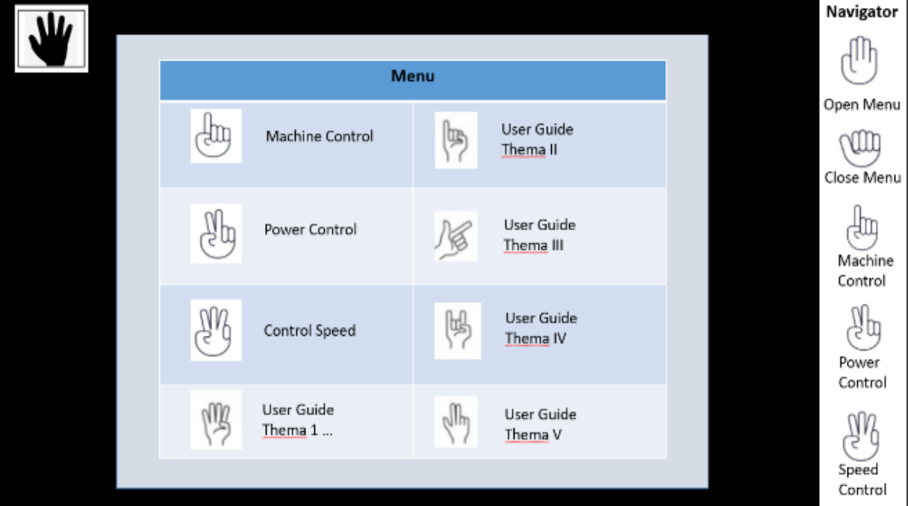

<div align="center">
  <h1>Gesture Volume Control Using OpenCV and MediaPipe</h1>
  
 </div>

> Gesture recognition is an active research field in Human-Computer Interaction technology. It has many applications in virtual environment control and sign language translation, robot control, or music creation. In this machine learning project on Hand Gesture Recognition, we are going to make a real-time Hand Gesture Recognizer using the MediaPipe framework and Tensorflow in OpenCV and Python.

## 💾 REQUIREMENTS
+ opencv-python
+ mediapipe
+ comtypes
+ numpy
+ pycaw

```bash
pip install -r requirements.txt
```
***
### MEDIAPIPE
<div align="center">
  
</div>

> MediaPipe offers open source cross-platform, customizable ML solutions for live and streaming media.

This advanced hand tracking system involves two crucial steps: 
 ## palm detection 
 ## hand landmark localization 
 Initially, the system pinpoints the hand's location in the entire image, akin to identifying where the hand is in a given picture. Subsequently, it zooms in on the detected hand region and utilizes a detailed model to accurately locate 21 key points, representing the knuckles in 3D space. These points provide a comprehensive representation of the hand's internal pose, exhibiting robustness even in scenarios with partially visible hands or self-occlusions. To train the system, approximately 30,000 real-world images were manually annotated with 21 3D coordinates, while high-quality synthetic hand models were rendered over diverse backgrounds to enhance the system's understanding of various hand poses and geometries. This dual approach ensures the system's proficiency in capturing intricate hand movements and shapes across different contexts.

#### Solution APIs
##### Configuration Options
> Naming style and availability may differ slightly across platforms/languages.

+ <b>STATIC_IMAGE_MODE</b><br>
If set to false, the solution treats the input images as a video stream. It will try to detect hands in the first input images, and upon a successful detection further localizes the hand landmarks. In subsequent images, once all max_num_hands hands are detected and the corresponding hand landmarks are localized, it simply tracks those landmarks without invoking another detection until it loses track of any of the hands. This reduces latency and is ideal for processing video frames. If set to true, hand detection runs on every input image, ideal for processing a batch of static, possibly unrelated, images. Default to false.

+ <b>MAX_NUM_HANDS</b><br>
Maximum number of hands to detect. Default to 2.

+ <b>MODEL_COMPLEXITY</b><br>
Complexity of the hand landmark model: 0 or 1. Landmark accuracy as well as inference latency generally go up with the model complexity. Default to 1.

+ <b>MIN_DETECTION_CONFIDENCE</b><br>
Minimum confidence value ([0.0, 1.0]) from the hand detection model for the detection to be considered successful. Default to 0.5.

+ <b>MIN_TRACKING_CONFIDENCE:</b><br>
Minimum confidence value ([0.0, 1.0]) from the landmark-tracking model for the hand landmarks to be considered tracked successfully, or otherwise hand detection will be invoked automatically on the next input image. Setting it to a higher value can increase robustness of the solution, at the expense of a higher latency. Ignored if static_image_mode is true, where hand detection simply runs on every image. Default to 0.5.

<br>

Source: [MediaPipe Hands Solutions](https://google.github.io/mediapipe/solutions/hands#python-solution-api)

<div align="center">
    
    
    
</div>


<div align = "center">
<h2>📲 Contact</h2>

If you want to contact me, you can reach me through below handle.

 <a href="https://www.linkedin.com/in/navya-sri-b8854426a/"> Navya Sri</img></a>

</div>
